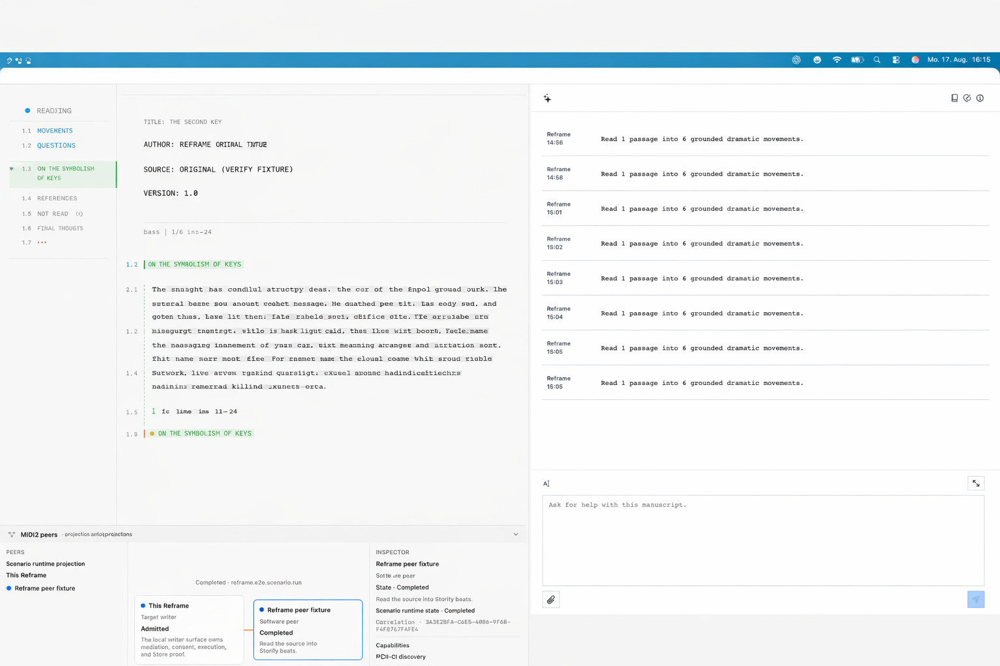

# Governance Chapter 79 — The Default Semantic Manuscript Projection

This public projection explains the governed direction of Reframe's default writer surface. The authoritative chapter
is maintained in [Reframe-Refactoring](https://github.com/Fountain-Coach/Reframe-Refactoring/blob/main/docs/79-default-semantic-manuscript-projection.md);
this page is a sanitized human reference, not a runtime contract.

*Design reference only. The illustration does not prove runtime behavior, accessibility semantics, FountainStore state,
visual-regression acceptance, or a released App surface.*

## The governed projection

Reframe's default workspace is a continuous, scrollable Fountain manuscript in its Courier/Fountain register. Semantic
navigation sits beside the text, Copilot remains on the right, and the MIDI2 peer projection remains at the bottom.
These are coordinated surfaces of one Reframe window, not separate application shells.

The navigation keeps three meanings distinct:

- **Questions** — source-grounded question spans and their lifecycle;
- **Movements** — source-grounded changes, including settled changes that raise no question; and
- **Read coverage** — what the current reading actually covered.

Selecting a semantic item points back to its source span. Overlapping Questions and Movements remain separate records and
may be shown as parallel marks. Colour is supportive, never the sole semantic signal.

## What this excludes

The default projection is not an A4 page-card gallery, a horizontal timeline, a single undifferentiated movement list,
a permanent score dashboard, or Slugline's File/Edit/Format/Outline/View/Window/Help application chrome. Historical
`beat` identities may remain for compatibility, but new writer-facing labels use Questions and Movements.

UncertaintyScoreKit projects persisted findings over the manuscript; it does not redefine their semantics. MIDI2 carries
the negotiated lifecycle at the system boundary, AX exposes the visible projection, and FountainStore remains behavioral
authority. The Book publishes only the sanitized design and governance claim.

## Acceptance boundary

An implementation requires focused tests, AX observations, a window-ID visual capture, and matching FountainStore
evidence bound to one run. The generated signature illustration is intentionally not that evidence.

Read the [full governance chapter](https://github.com/Fountain-Coach/Reframe-Refactoring/blob/main/docs/79-default-semantic-manuscript-projection.md)
and the [Scenario-Driven Development method](SCENARIO-DRIVEN-DEVELOPMENT.md).
