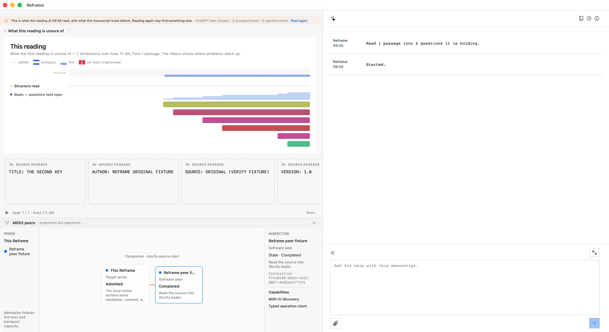

# Reframe-to-Reframe MIDI2 software-peer projection

Reframe can be driven by another Reframe process through the governed MIDI2 backplane. This is a system capability,
not a new writer command and not a second Copilot persona.

The exercised operation was the existing `storify.source.start` capability. The peer supplied typed intent; the target
Reframe retained semantic mediation, paid-lane/provider choice, writer consent, execution, and FountainStore proof.
MIDI2 carried the correlated lifecycle back to the peer, while the projections surface showed the relationship in the
writer-facing application.

## What the evidence establishes

The reusable scenario `reframe-to-reframe-peer-projection` completed this sequence:

1. A separate Reframe software peer discovered and connected to the target.
2. The peer requested `storify.source.start` over the MIDI2 transport.
3. The target exposed its normal writer confirmation through accessibility semantics.
4. After consent, the target Store recorded `requested → accepted → running → succeeded`.
5. The peer received the terminal MIDI2 event for the same operation.
6. The target's `MIDI2 peers` projection exposed the peer as a completed software peer and showed the completed
   operation.

The public evidence is sanitized. The acceptance run was bound to separate processes, one target window, one managed
Store, one validated executable, and source revision `cbf31bdb`; private process, Store, and correlation identifiers
remain in the maintainer evidence bundle rather than this public projection.

## What this does not establish

This is software-peer acceptance. It does not claim interoperability with physical MIDI2 hardware, Bluetooth, or an
unbounded number of remote peers. A future peer must still negotiate the declared MIDI2 roles, pass admission and
capacity checks, and produce its own independent evidence.

It also does not give a peer authority to select Reframe's model or lane, bypass consent, write the target Store, or
assert completion without the target's terminal proof.

## Where it appears

- Scenario: [`reframe-to-reframe-peer-projection`](../scenarios/coverage.json)
- Evidence record: [`2026-08-16 peer terminal acceptance`](../evidence/2026-08-16/reframe-peer-terminal.md)
- Governing Chapter 70: [External MIDI2 Control of Reframe](https://github.com/Fountain-Coach/Reframe-Refactoring/blob/main/docs/70-external-midi2-control-of-reframe.md)
- Governing Chapter 71: [Reframe-to-Reframe Software-Peer Acceptance](https://github.com/Fountain-Coach/Reframe-Refactoring/blob/main/docs/71-reframe-to-reframe-software-peer-acceptance.md)
- Governing Chapter 72: [MIDI2 Peer Projections and Capacity Admission](https://github.com/Fountain-Coach/Reframe-Refactoring/blob/main/docs/72-midi2-peer-projections-and-capacity-admission.md)

## Release boundary

This is a development-snapshot capability projection. The Book's release surface remains `no-released-build` with an
empty allow-list. Documenting this evidence does not add a released App capability.
