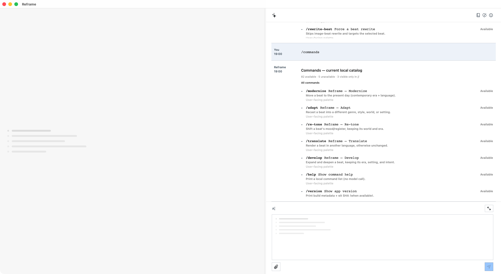

# Discover commands

`/commands`

Opens the complete runtime command catalog in the Copilot result surface. The live result exposes the command rows
through the AX tree rather than presenting a screenshot-only inventory.

Live drive: [scenario acceptance evidence](../evidence/2026-08-15/commands-scenario-live.md) · [historical full catalog evidence](../evidence/2026-08-03/verified-command-catalog.md)

Scenario: `commands-discover` · [coverage record](../scenarios/coverage.json) · live-accepted.

Behavioral proof: `app.commands.discover`, three terminal scenario runs in a fresh managed session; the current
sanitized result exposes 82 available, 5 unavailable, and 3 compatibility-only entries. The acceptance window was
captured by CoreGraphics window ID after the result state was reached.

## Individually documented commands

- [`/pipeline status`](pipeline-status.md) — live-accepted read-only pipeline truth with AX, window-ID, and
  FountainStore evidence.
- [`/threads`](threads.md) — live-accepted uncertainty ledger inspection with AX, window-ID, and FountainStore
  evidence.
