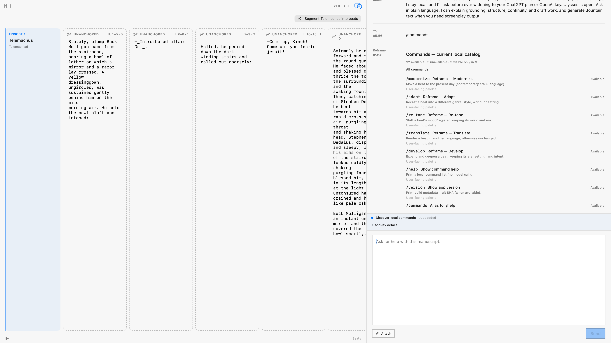

# Discover commands

`/commands`

Opens the complete runtime command catalog in the Copilot result surface. The live result exposes the command rows
through the AX tree rather than presenting a screenshot-only inventory.

Live drive: [full catalog acceptance evidence](../evidence/2026-08-03/verified-command-catalog.md)

Behavioral proof: `app.commands.discover`, corpus `reframe-ulysses`; the sanitized evidence records 95 entries,
92 available, and 3 unavailable. The original window was captured by CoreGraphics window ID after the result state
was reached.

## Individually documented commands

- [`/pipeline status`](pipeline-status.md) — live-accepted read-only pipeline truth with AX, window-ID, and
  FountainStore evidence.
