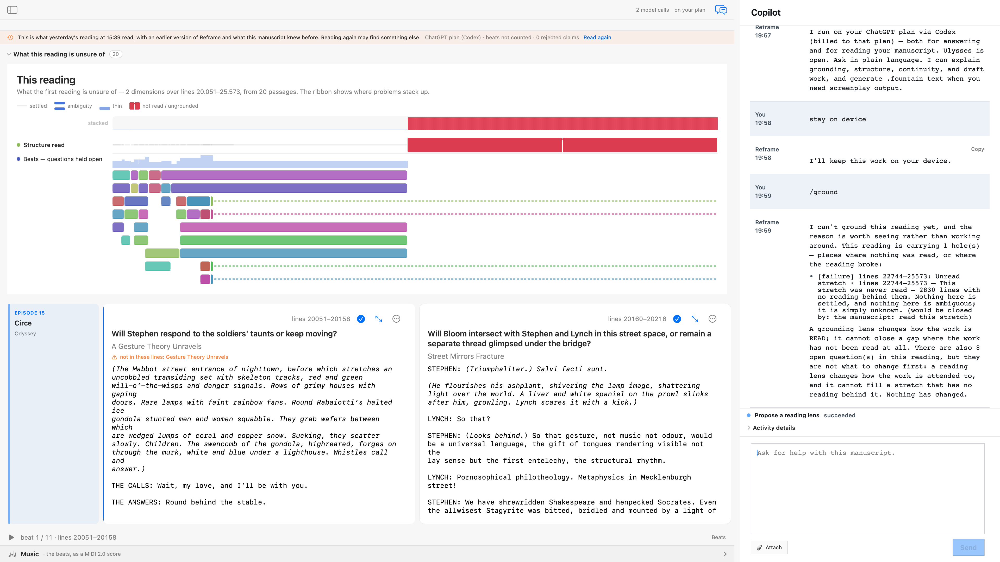

# `/ground`

`/ground` asks Reframe to propose a **reading lens** — a change in what the next reading should look for — derived
from what the current reading is actually unsure of. It is the acceptance boundary of the grounding flow: the
proposal is an offer, and nothing changes until the writer accepts it.

It never edits the manuscript. A lens changes the policy of attention, not the text, the author baseline, or the
draft.

## Live result

Driven on the Ulysses Circe chapter (episode 15, ll. 20051–25573), `/ground` **offered nothing, and said why**:

> I can't ground this reading yet… This reading is carrying 1 hole(s) — places where nothing was read, or where the
> reading broke:
>
> - [failure] lines 22744–25573: Unread stretch — 2830 lines with no reading behind them. Nothing here is settled,
>   and nothing here is ambiguous; it is simply unknown.
>
> A grounding lens changes how the work is READ; it cannot close a gap where the work has not been read at all…
> Nothing has changed.

That is the command working, not failing. Of the reading's two problems — 8 open questions and one unread stretch —
only one of them is a lens problem, and `/ground` refuses to dress the other up as one. The persisted runtime state
says the same thing the prose does: `grounding.proposal=false`, `grounding.changed=false`,
`grounding.blockedBy=readingHasHoles`.

## What a writer should expect

| | |
| --- | --- |
| **When it helps** | After a reading has covered its span and left real ambiguity — then the score can name a direction worth re-reading for. |
| **When it declines** | When the reading has holes. An unread stretch is closed by reading it, not by attending to it differently. |
| **What it costs** | Nothing. No model call was recorded for this turn; the stance is derived from the persisted uncertainty score. |
| **What it changes** | Nothing, until you accept. Acceptance creates a new grounding lineage; the proposal alone does not. |

## Evidence authorities

Live drive: [ground live acceptance evidence](../evidence/2026-08-09/verified-ground.md)

- [Live-drive record](../evidence/2026-08-09/verified-ground.md) — AX semantics, CoreGraphics window-ID capture, and
  persisted FountainStore proof, with the second confirming pass.
- Capability aggregate `copilot:capability:reframe-ulysses:41e02fb6-aed9-45f7-a891-67fc9737a60c` —
  `prep.grounding.propose`, origin `slash`, phase `succeeded`, terminal.
- [Result snapshot](../evidence/2026-08-09/ground-live-ulysses-circe-20260809.png) — the command's own GUI state.

## Boundary

`/ground` is a slash alias of the governed capability `prep.grounding.propose`. It is not an entry in the numbered
development command catalog, because it is reached through the capability registry rather than the slash index — see
[`../CAPABILITY-ATLAS.md`](../CAPABILITY-ATLAS.md).

This is development, live-accepted evidence for the **slash origin only**. It does not promote the capability into a
released App surface — [`../RELEASE-SURFACE.md`](../RELEASE-SURFACE.md) remains `no-released-build` with an empty
allow-list — and it does not claim acceptance for the natural-language origin, or for the second half of the flow in
which a writer confirms a proposed lens and the work is re-read through it. This reading's unread stretch made that
half unreachable, which is exactly what the command reported.

The manuscript shown is James Joyce's *Ulysses* (public domain), assembled by Reframe's own corpus API. The Copilot
text is Reframe's output. The image is full fidelity under a recorded rights and scope review.

Scenario: `ground-after-reading` · [coverage record](../scenarios/coverage.json) · draft; legacy evidence requires a
new scenario run.
