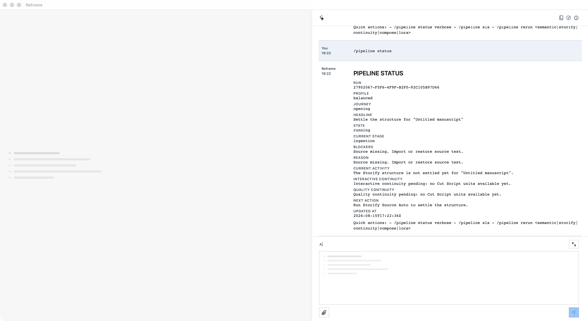

# `/pipeline status`

`/pipeline status` gives the writer a compact, current view of the manuscript pipeline. It reports the run, journey,
headline, state, current stage, blockers, current activity, continuity notes, and the next action. It is a read-only
diagnostic command: it does not write the draft and does not ask for confirmation.

## Live result

The governed external-display drive returned `PIPELINE STATUS` with the pipeline truth:

> Source missing. Import or restore source text.

The observed empty active-manuscript state is truthful: the command reports that the source must be imported or
restored and points to `Storify Source Auto` as the next action. This is a read-only diagnostic, not a claim that the
manuscript is ready for a release surface.

## Evidence authorities

Live drive: [pipeline-status live acceptance evidence](../evidence/2026-08-15/verified-pipeline-status.md)

- **AX semantics:** the interaction used `studio-chat-input` and `studio-chat-send`; the result exposed the
  `chat-row-message-*` response containing `PIPELINE STATUS`.
- **Visual:** the image above is a CoreGraphics window-ID capture after Reframe was moved to the attached 1920×1080
  display.
- **Behavioral:** `ReframeStoreDump` recorded three runs, each with `pipeline.status` lifecycle phases
  `requested → accepted → running → succeeded`. The command remained read-only; no draft mutation was observed.

Detailed sanitized drive notes: [pipeline-status live acceptance evidence](../evidence/2026-08-15/verified-pipeline-status.md).

Scenario: `pipeline-status` · [coverage record](../scenarios/coverage.json) · live-accepted; three-run AX, Store, and
window proof.

## Boundary

This page documents an evidence-backed development capability. It does not promote the command into a released App
surface; the release boundary remains [RELEASE-SURFACE.md](../RELEASE-SURFACE.md).
