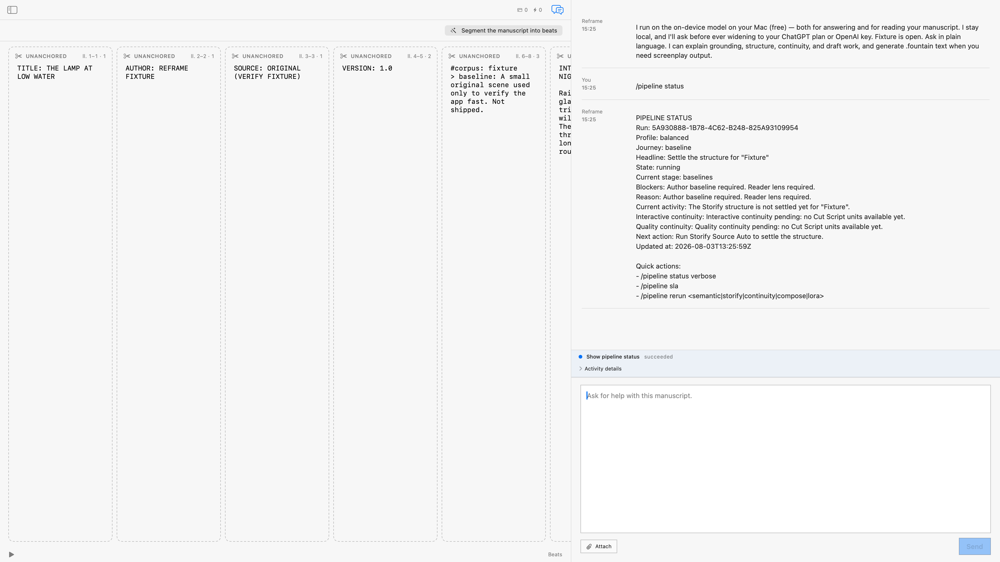

# `/pipeline status`

`/pipeline status` gives the writer a compact, current view of the manuscript pipeline. It reports the run, journey,
headline, state, current stage, blockers, current activity, continuity notes, and the next action. It is a read-only
diagnostic command: it does not write the draft and does not ask for confirmation.

## Live result

The fresh fixture drive returned `PIPELINE STATUS` with the pipeline truth:

> ✓ Ingestion → ✓ Parse + Convert → ✓ Translate → ○ Baselines → ○ Reading (full) → ○ Storify Annotation →
> ○ Continuity Audit (advisory) → ✓ Editor Unlock

The fixture was intentionally small and development-only. The observed run was still in the `baselines` stage and
reported that an author baseline and reader lens were required. That is a truthful pipeline state, not a claim that
the manuscript was ready for a release surface.

## Evidence authorities

Live drive: [pipeline-status live acceptance evidence](../evidence/2026-08-03/verified-pipeline-status.md)

- **AX semantics:** the interaction used `studio-chat-input` and `studio-chat-send`; the result exposed the
  `chat-row-message-*` response and `copilot-capability-activity` with description `Show pipeline status. Phase
  succeeded.`
- **Visual:** the image above is a CoreGraphics window-ID capture after Reframe was moved to the attached 1920×1080
  display and entered full screen.
- **Behavioral:** `ReframeStoreDump` recorded three fixture runs, each with `pipeline.status` lifecycle phases
  `requested → accepted → running → succeeded`, and three persisted `chat:fixture:round:*` documents. No draft write
  was recorded.

Detailed sanitized drive notes: [pipeline-status live acceptance evidence](../evidence/2026-08-03/verified-pipeline-status.md).

Scenario: `pipeline-status` · [coverage record](../scenarios/coverage.json) · draft; legacy evidence requires a new
scenario run.

## Boundary

This page documents an evidence-backed development capability. It does not promote the command into a released App
surface; the release boundary remains [RELEASE-SURFACE.md](../RELEASE-SURFACE.md).
