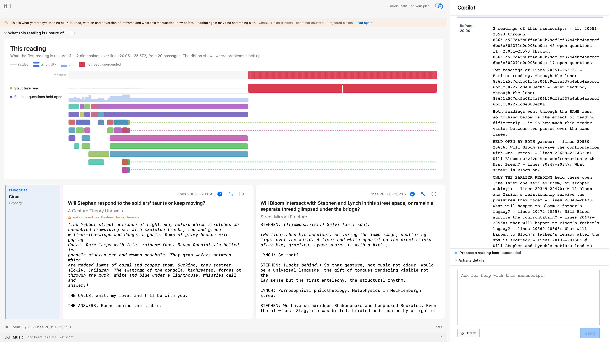

# `/readings`

`/readings` compares the readings a manuscript has accumulated. Every reading Reframe performs is kept, with the
lens it read through and the lines it covered, so two readings of the same span can be set against each other: what
both passes held open, what one settled, what the other newly opened, and where they cut the beats differently.

The point is not a bigger list of questions. It is the difference between a question the **work** leaves open and a
question **this reading** happened to raise.

## Live result

Live drive: the Ulysses Circe comparison was driven through the governed Reframe acceptance path and its AX, Store,
and window-ID evidence is linked below.

Driven on the Ulysses Circe chapter (episode 15), where the store held two readings of lines 20051–25573 — one with
45 open questions, one with 17 — the report opened by disqualifying its own most attractive conclusion:

> Both readings went through the SAME lens, so nothing below is the effect of reading differently — it is how much
> this reader varies between two passes over the same lines.

Then it handed over the material, every item addressed to its lines: three questions **held open by both passes**
(including *"Will Bloom survive the confrontation with Mrs. Breen?"* and *"What street is Bloom on?"*), fourteen the
later pass dropped, thirty-three the later pass opened, and twelve line numbers where one reading cut a beat and the
other did not.

It closed by naming what it could and could not establish:

> The passage genuinely leaves open whether Bloom will survive the confrontation with Mrs. Breen and what street
> Bloom is on. The other questions were not stable across readings, so they appear to be artifacts of the reading
> process rather than securely supported ambiguities.

Run a second time, the same comparison ended: *"…the readings agree too closely to support a more specific lens."*

## What a writer should expect

| | |
| --- | --- |
| **When it helps** | Once the same span has been read twice — ideally through two different lenses. Then the difference means something. |
| **What it will refuse to say** | Whose the uncertainty is — the work's or the reader's — on the strength of one pair. Two passes through one lens measure the instrument, and the report says so. |
| **When there is nothing to compare** | It says so plainly rather than reasoning about what would have changed. |
| **What it costs** | No paid model call was recorded in this drive. The comparison is arithmetic over readings already persisted; the closing paragraph is model prose whose lane was not read back. |
| **What it changes** | Nothing. It reports; it never reverts a lens or edits the manuscript. |

## Evidence authorities

Current scenario acceptance: [repeatable readings scenario evidence](../evidence/2026-08-15/verified-readings-scenario.md)

Historical product drive: [Ulysses readings evidence](../evidence/2026-08-09/verified-readings.md)

- [Live-drive record](../evidence/2026-08-09/verified-readings.md) — AX semantics, CoreGraphics window-ID capture,
  the two source readings, and the persisted round, with the second confirming pass.
- Persisted turn `chat:reframe-ulysses:round:20`, computed from `storify:run:reframe-ulysses:stf-9512cc87` and
  `storify:run:reframe-ulysses:stf-66e626a2` and their window documents.
- [Result snapshot](../evidence/2026-08-09/readings-live-ulysses-circe-20260809.png) — the command's own GUI state.

## Boundary

`/readings` is entry 12 of the development command catalog and is **local orchestration**: it is routed inside the
runtime rather than through the Copilot capability registry, so it has no capability identity, no
`copilot:capability:*` aggregate, and no AX capability-activity projection. Its proof is the persisted round and the
readings it is computed from.

This is development evidence. [`../RELEASE-SURFACE.md`](../RELEASE-SURFACE.md) remains `no-released-build` with an
empty allow-list; documenting this command does not add anything to it.

The manuscript shown is James Joyce's *Ulysses* (public domain), assembled by Reframe's own corpus API. The reading
questions and the comparison narration are Reframe's output. The image is full fidelity under a recorded rights and
scope review.

Scenario: `readings-comparison` · [coverage record](../scenarios/coverage.json) · live-accepted; the bounded fixture
scenario proved two distinct paid-lane reading executions, AX semantics, Store receipts, and window-ID evidence.
