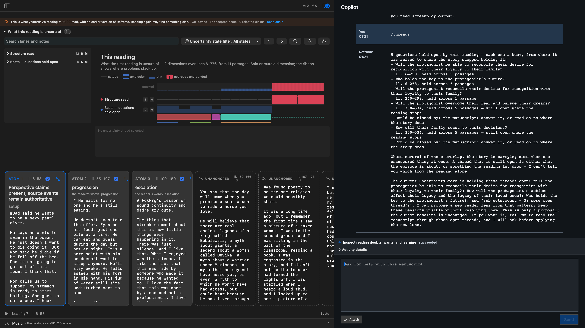

# `/threads`

`/threads` reports what the current reading is still holding open. It gives the writer a compact uncertainty ledger: the questions raised by the reading, where they remain open, and what kind of manuscript decision could close them.

## Live result

On a fresh managed fixture, `/threads` completed through the governed Copilot route and reported five open reading questions. The result was exposed in the AX tree through the assistant result row and the capability activity surface. The uncertainty score was disclosed by default, showing the `Structure read` and `Beats — questions held open` lanes above the manuscript atoms. The run was read-only: it inspected the current reading and did not change the manuscript or author baseline.

## Evidence authorities

- [Live-drive record](../evidence/2026-08-03/verified-threads.md) — AX, window-ID capture, and persisted FountainStore proof.
- [Full-fidelity result snapshot](../evidence/2026-08-04/threads-live-polyx-courier-20260804.png) — the command’s own GUI state, including the owned Polyxsupershow sixth-draft evidence and visible uncertainty lanes.

## Boundary

This is development/live-accepted evidence for the slash-command origin. It does not promote `manuscript.reading.inspect` to a released capability, and it does not claim that the separate natural-language origin or a complete Storify run has passed live acceptance. The screenshot contains publisher-owned Polyxsupershow sixth-draft material and the resulting Copilot question text by explicit publisher declaration; its scope is this read-only GUI result, with no private store export, credentials, personal data, or third-party material included. The image is therefore full fidelity rather than obfuscated.
