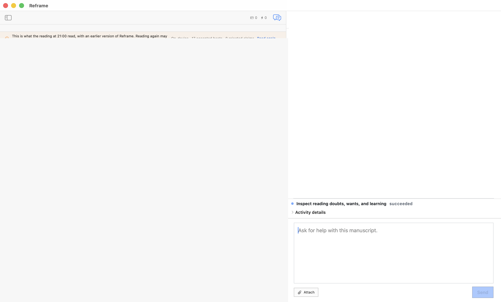

# `/threads`

`/threads` reports what the current reading is still holding open. It gives the writer a compact uncertainty ledger: the questions raised by the reading, where they remain open, and what kind of manuscript decision could close them.

## Live result

On a fresh managed fixture, `/threads` completed through the governed Copilot route and reported five open reading questions. The result was exposed in the AX tree through the assistant result row and the capability activity surface. The run was read-only: it inspected the current reading and did not change the manuscript or author baseline.

## Evidence authorities

- [Live-drive record](../evidence/2026-08-03/verified-threads.md) — AX, window-ID capture, and persisted FountainStore proof.
- [Sanitized result snapshot](../evidence/2026-08-03/threads-live-20260803.png) — the command’s own GUI state, with manuscript and transcript content redacted.

## Boundary

This is development/live-accepted evidence for the slash-command origin. It does not promote `manuscript.reading.inspect` to a released capability, and it does not claim that the separate natural-language origin or a complete Storify run has passed live acceptance. The public page contains only the sanitized projection; private source and question text remain in the managed fixture.
