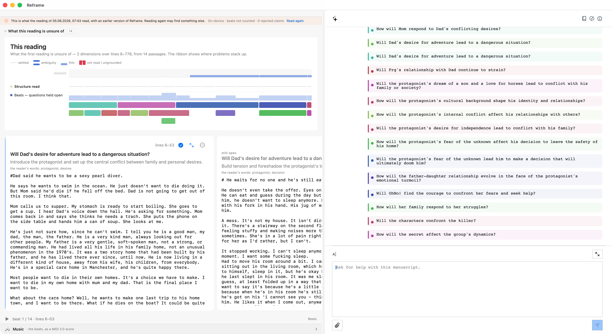

# `/threads`

`/threads` reports what the current reading is still holding open. It gives the writer a compact uncertainty ledger: the questions raised by the reading, where they remain open, and what kind of manuscript decision could close them.

## Live result

On a fresh managed fixture, the reusable `threads` scenario completed through the governed Copilot route. The result was exposed in the AX tree through `story-uncertainty-band`, and the capability activity reached `succeeded` in FountainStore. The run was read-only: it inspected the current reading and did not change the manuscript or author baseline.

## Evidence authorities

Live drive: [threads live acceptance evidence](../evidence/2026-08-15/verified-threads.md)

- [Scenario acceptance record](../evidence/2026-08-15/verified-threads.md) — AX, window-ID capture, and persisted FountainStore proof.
- [Current result snapshot](../evidence/2026-08-15/threads-live-20260815.png) — the command's own GUI state after the terminal result appeared.
- [Full-fidelity result snapshot](../evidence/2026-08-04/threads-live-polyx-courier-20260804.png) — the command’s own GUI state, including the owned Polyxsupershow sixth-draft evidence and visible uncertainty lanes.

## Boundary

This is development/live-accepted evidence for the slash-command origin. It does not promote `manuscript.reading.inspect` to a released capability, and it does not claim that the separate natural-language origin or a complete Storify run has passed live acceptance. The older screenshot remains publisher-declared historical evidence; the current snapshot publishes only the reviewed GUI result and no private Store export, credentials, personal data, or raw runtime identifiers.

Scenario: `threads` · [coverage record](../scenarios/coverage.json) · live-accepted; one governed slash-origin run with AX, Store, and window-ID proof.
